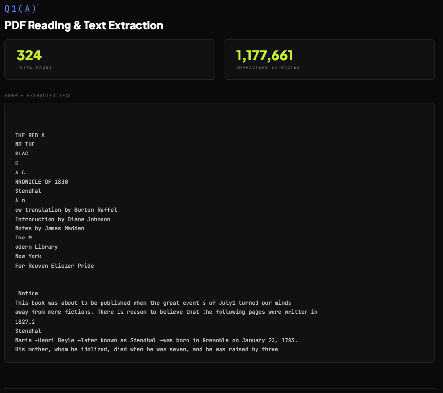
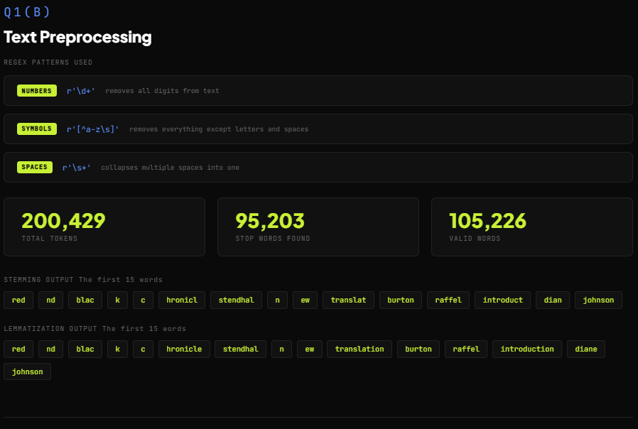
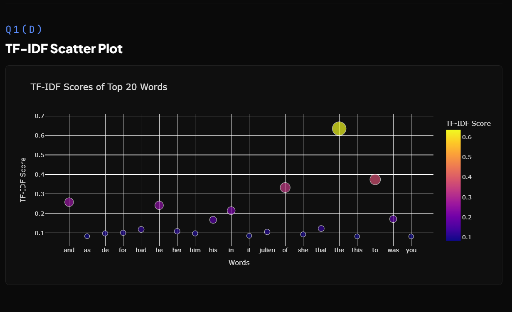

# NLP Text Processing for PDFs

A complete NLP pipeline that reads a real PDF book, cleans the text, extracts features, and displays everything in a clean web report.

---

## PDF Used
The one I used is **The Red and the Black** by Stendhal which is 324 pages but you can add your own pdf to the folder. 

Source: https://www.gutenberg.org

---

## What It Does

- Reads and extracts text from a 324 page PDF
- Cleans the text using Regex patterns
- Removes stopwords, applies stemming and lemmatization
- Applies One Hot Encoding and TF-IDF feature extraction
- Generates a clean HTML report with an interactive Plotly scatter plot that opens in your browser automatically

---

## Files

| File | Purpose |
|---|---|
| `nlp_code.py` | Main script — runs the full NLP pipeline |
| `template.html` | The HTML design file for the report |
| `nlp_report.html` | Auto-generated when you run the code |
| `The Red and the Black.pdf` | The PDF used for processing |

---

## How to Run

Install the required libraries:

```
pip install PyPDF2 nltk scikit-learn plotly pandas
```

Then just run:

```
python nlp_code.py
```

---

## NLP Pipeline

**Q1(a) — PDF Reading**  
Opens the PDF and extracts raw text from all 324 pages using PyPDF2


**Q1(b) — Text Preprocessing**  
Converts to lowercase, removes numbers with `r'\d+'`, removes symbols with `r'[^a-z\s]'`, collapses spaces with `r'\s+'`, then tokenizes, removes stopwords, applies stemming and lemmatization


**Q1(c) — Feature Extraction**  
Applies One Hot Encoding on a sample of 50 words and TF-IDF on the full text with top 20 features, both shown in table form


**Q1(d) — Plotly Scatter Plot**  
Interactive scatter plot of TF-IDF scores for the top 20 words, built entirely with Plotly


---

## Results

| Metric | Value |
|---|---|
| Total Pages | 324 |
| Characters Extracted | 1,177,661 |
| Total Tokens | 200,429 |
| Stop Words Found | 95,203 |
| Valid Words | 105,226 |
| TF-IDF Features | 20 |

---

## Troubleshooting

If you get a ModuleNotFoundError run this instead:

```
python -m pip install PyPDF2 nltk scikit-learn plotly pandas
```

If NLTK data is missing:

```
python -c "import nltk; nltk.download('all')"
```
